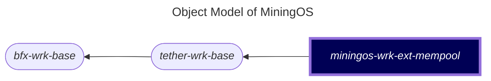

# miningos-wrk-ext-mempool

## Table of Contents

1. [Overview](#overview)
2. [Object Model](#object-model)
3. [Installation](#installation)
4. [Configuration](#configuration)
5. [Running the Worker](#running-the-worker)
6. [Data Structure](#data-structure)
7. [Api Integration](#api-integration)

## Overview

The Mempool worker is a specialized service within the MiningOS ecosystem that interfaces with the Mempool.space API to collect and store real-time Bitcoin network data. This worker serves as a critical data aggregation layer for mining operations, providing essential metrics such as network hashrate, difficulty adjustments, transaction fees, and Bitcoin prices.

### Key Features

- **Real-time Data Collection**: Fetches Bitcoin network statistics at configurable intervals
- **Historical Data Storage**: Maintains price history for 24 hours and hashrate history for 180 days
- **Automatic Calculations**: Computes 24-hour price changes and block reward averages across multiple timeframes
- **Scheduled Statistics**: Builds aggregated statistics at 30-minute, 3-hour, and daily intervals
- **Persistent Storage**: Uses Hyperbee for efficient time-series data storage
- **RPC Interface**: Provides network data to other services through RPC methods

## Object Model

The worker follows a hierarchical class structure within the MiningOS ecosystem:




The architecture ensures modularity and code reusability while maintaining separation of concerns between generic worker functionality and Mempool-specific operations.

## Installation

### Prerequisites

- Node.js >= 20.0

### Setup Steps

1. **Clone the repository**:
```bash
git clone https://github.com/tetherto/miningos-wrk-ext-mempool.git
cd miningos-wrk-ext-mempool
```

2. **Install dependencies**:
```bash
npm install
```

3. **Configure the worker**:
```bash
./setup-config.sh
```

## Configuration

### Configuration Files

The worker uses several configuration files located in the `config/` directory:

#### config/mempool.json

Controls Mempool API connection and data collection intervals:
```json
{
  "baseUrl": "https://mempool.space/api",
  "dataFetchIntervalMs": 1800000,           // Current data fetch interval (30 minutes)
  "historicalDataFetchIntervalMs": 43200000  // Historical data fetch interval (12 hours)
}
```

#### config/common.json

General worker configuration:

```json
{
  "dir_log": "logs",  // Directory for log files
  "debug": 0          // Debug level (0=off, 1=on)
}
```

#### config/facs/ Directory

Contains facility configurations for network and storage components:
- `net.config.json`: Network configuration for RPC communication
- `store.config.json`: Storage configuration for Hyperbee database

### Environment Variables

Enable comprehensive debug logging:
```bash
node worker.js --wtype wrk-ext-mempool-rack --env development --rack rack-1
```

### RPC Interface

The worker exposes three RPC methods:

1. **`ping`** (inherited): Health check endpoint
2. **`getInstanceId`** (inherited): Returns unique worker instance identifier
3. **`getWrkExtData`**: Returns mempool data and historical statistics

## Running the Worker

### Starting the Worker

Launch the Mempool worker with the following command:

```bash
DEBUG="*" node worker.js --wtype wrk-ext-mempool-rack --env development --rack rack-1
```

Parameters explained:
- `--wtype`: Worker type identifier (must be `wrk-ext-mempool-rack`)
- `--env`: Environment setting (development/production)
- `--rack`: Rack identifier for this worker instance

### Verifying Operation

Once started, the worker will:
1. Start the RPC server (from parent class)
2. Register RPC methods: `ping`, `getInstanceId`, `getWrkExtData`
3. Initialize database connection and load existing data
4. Initialize the Mempool.space API client
5. Fetch initial data from all configured endpoints
6. Schedule periodic updates:
   - Live data refresh every 30 minutes (configurable)
   - Historical data refresh every 12 hours (configurable)

Check the worker status:
```bash
cat status/wrk-ext-mempool-rack-rack-1.json
```

**Note:** The RPC server becomes available immediately upon startup, before data fetching completes. Early RPC calls may return cached data from the database.

## Data Structure

### Internal Data Model

The worker maintains the following data structure internally:

```javascript
mempoolData = {
  // Price tracking
  prices: [                           // Array of price history entries
    { time: timestamp, price: value }
  ],
  currentPrice: 0,                   // Latest BTC price in USD
  priceChange24Hrs: 0,              // Calculated 24-hour change percentage
  
  // Network metrics
  blockHeight: 0,                    // Current blockchain height
  currentHashrate: 0,                // Latest network hashrate
  currentDifficulty: 0,              // Current mining difficulty
  
  // Difficulty adjustment
  adjustments: {
    progressToDifficulty: 0,          // Progress percentage
    nextAdjustmentTs: 0,              // Unix timestamp
    nextAdjustmentExp: 0,             // Expected change percentage
    prevAdjustment: 0,                // Previous adjustment percentage
    avgBlockTime: 0                   // Minutes
  },
  
  // Historical hashrates
  hashrates: [                        // Array of hashrate snapshots
    { tag: string, time: timestamp, hashrate: value }
  ],
  
  // Reward calculations
  blockRewardAvgs: {                  // Averages in BTC
    '24h': 0, '3d': 0, '1w': 0,
    '1m': 0, '3m': 0, '6m': 0,
    '1y': 0, '2y': 0, '3y': 0
  },
  
  // Fee market
  transactionFees: {                  // Satoshis per vByte
    fastest: 0,
    halfHour: 0,
    hour: 0
  }
}
```

### Data Retention Policies

- **Price History**: Retained for 24 hours
- **Hashrate History**: Retained for 180 days
- **Block Rewards**: Calculated from 3-year historical data

## API Integration

### Mempool.space API Endpoints

The worker interfaces with the following Mempool.space API endpoints:

- **Prices** (/v1/prices): Current Bitcoin price in multiple currencies
- **Block Height** (/blocks/tip/height): Latest block number
- **Block Rewards** (/v1/mining/blocks/rewards/3y): Historical mining rewards
- **Difficulty Adjustments** (/v1/difficulty-adjustment): Next adjustment predictions
- **Hashrate** (/v1/mining/hashrate/3d): Network hashrate statistics
- **Transaction Fees** (/v1/fees/recommended): Recommended fee rates
- **Historical Prices** (/v1/historical-price): Price data at specific timestamps
- **Block by Timestamp** (/v1/mining/blocks/timestamp/{ts}): Block at given timestamp
- **Block Details** (/v1/block/{hash}): Detailed block information
   
### Rate Limiting

To respect API rate limits, the worker implements:
1. 1-second delay between API calls during batch fetches
2. Configurable fetch interval (default: 30 minutes)
3. Error Handling:
   - Failed API calls return `null` and log errors to console
   - Worker continues operation even if individual fetches fail
   - No automatic retry mechanism implemented
